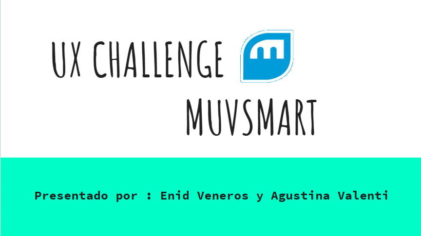
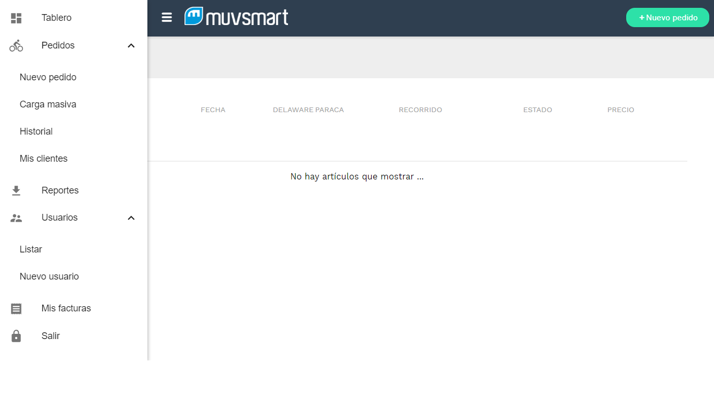

-----------------------------------------
# Desafío Desarrolado para Muvsmart - Ganadoras del primer premio. 

# Muvsmart es una Start Up con menos de 2 años en el mercado que ofrecen un servicio de "envios" de un punto a otro. Su propuesta de valor y lo que los diferencia de su competencia consiste en : 
 - Ser sustentable  
 - Movimiento limpio. No dejar huella ( sus moovers se transportan en bicis y autos electricos)  
 - No poseen Bodega. Servicio sumamente rápido.  

# Que problema nos presentaron? El desafío consistia en :

- Identificar quienes eran sus reales usuarios.  
- Mejorar el flujo de navegación en “CREAR PEDIDOS”.  
- Ayudar a establecer un tamaño entendible por los usuarios ( respecto a los objetos que ellos quieren enviar).  

# Como lo hicimos?

- Primer paso:  
 "Planning" : definir tareas y actividades a realizar.  
- Segundo paso:   
“Entendiendo el problema”.Investigación, benchmark, estudio de negocio,  acercamiento a sus clientes,  encuestas.  
- Tercer paso:  
 "Síntesis y definición ". Organizar información. Agrupar los hallazgos.  
- Cuarto paso:   
"Idear" una propuesta de mejora. Gestión de contenido. Wireframes a papel.  
- Quinto paso:   
"Prototipar y testear".Realización de test a/b. Testeo del flujo de navegación. Implementar el feedback recibido. Iterar.  

# Insights ( hallazgos descubiertos a través de la investigación, testeos, encuestas) :
- Sus usuarios, la gran mayoría, son dueños. Le siguen empleados con cargo de administración.  
 - Los tamaños en cuanto al objeto que se envia, deben ser descriptivos con palabras claras.  
 - El acceso a los clientes a la plataforma de “crear pedido” debe ser más visible.  
 - El usuario quiere poder editar/cancelar su pedido.  
 - Informar al usuario como debe embalar el producto a transportar.  
 - Poder añadir una dirección de retorno. Ya que no siempre el objeto debe volver al mismo lugar.  
 - Poder seguir el envío en línea.  
 - Horarios claros para la entrega del objeto a transportar.  

# Sitio web de Muvsmart : https://muvsmart.com/

# Prototipo mejorado "Nuestra propuesta" :

https://www.figma.com/proto/bxk0zVdKbNLoxhhiieOrA3Bj/Muvsmart?scaling=min-zoom&node-id=40%3A1040

# Conclusiones Finales:

Reto sumamente importante para poder desarrollarnos profesionalmente. 
Personalmente, me apasiona poder crear soluciones concretas y elocuentes ante la real necesidad de la empresa y sus usuarios. 
En este desafío, hemos logrado darle una visión clave a Muvsmart de sus usuarios. Entregamos , en una semana, datos específicos a tener en cuenta en correciones a futuro.  

